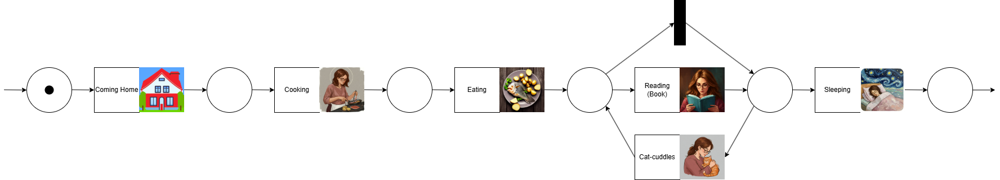

# CatNestIdentification: A Playful Exploration of Imaginary Feline Behavior Using Data Science

This project showcases my passion for data science by exploring an imaginary cat's behavior from two complementary perspectives:

1. **Automated image-based identification** of cat sleeping spots using machine learning.
2. **Behavioral modeling** of after-work routines with a cat using process mining techniques.

All data and images used in this project are artificially generated. The result is both a fun experiment and a demonstration of methods applicable to real-world problems for modeling, analyzing, and interpreting human-animal interactions.

It combines technical methods with playful ideas to explore complex behavior. For me, it's not just about cats — it's an enjoyable way to practice and share how I approach data, modeling, and experimentation.

## Project Goals

- Explore using **computer vision** and **clustering** for object detection in noisy environments.
- Simulate and analyze **human-cat interactions** using **Petri nets** and process mining.
- Practice designing end-to-end data science workflows with synthetic datasets.

## Part 1: Process Mining of After-Work Routines

Using process modeling, I simulated how a person and her cat interact after a long workday. These behaviors are modeled with **Petri nets** to show sequences, decisions, and parallel activities. This exploration also serves as a foundation for the later additions, e.g., the generation of artificial logs.

An extension with real-world data is possible later on. For example, to model the interactions between the cat, the person, and the weather. If the weather is bad, the cat is inside and needs to be entertained, making long gaming sessions less likely.

### Modeled Context 

The scenario is a woman, the cat's owner, coming home after work. Depending on the weather, the cat is inside or outside, leading to different possible routines.

### Activities Modeled

| Activity        | Icon                                                                 | Activity        | Icon                                                                  | Activity        | Icon                                                                 |
|----------------|----------------------------------------------------------------------|-----------------|-----------------------------------------------------------------------|-----------------|----------------------------------------------------------------------|
| Coming Home     |           | Cooking         |         | Eating          |               |
| Cat-cuddles     |  | Watching TV     |            | Reading (Book)  |        |
| Computer Gaming          |         | Sleeping        |        |                 |                                                                      |

### Modeled Scenarios
#### Scenario 1: Favorite Combination – TV and Cat-time

*Enjoying quality movies, accompanied by a purring companion on the couch.*

#### Scenario 2: Trying to Read a Book (with Optional Cat-cuddles)

*Attempting to read a good book while the cat regularly interrupts for attention.*

**Scenario 3: The Evening Gaming Session (Cat Respects Boundaries)**

*An uninterrupted gaming session — though cuddles might follow if the cat is in the mood.*

## Part 2: Automated Cat Nest Identification Using Clustering and Decision Trees

Part 2 uses decision trees to refine K-means clustering for automatic cat nest identification.

Automating the identification of areas where a cat prefers to sleep presents several challenges. For example, the colors of the cat nest and surrounding objects can be very similar. Additionally, features like softness and brightness, which are typical of cat nests, can also be found in non-cat spots. To address this, the project employs a series of machine learning tasks, executed sequentially. The analysis of these tasks is currently in progress.

The idea is the following:
1.  Identify sleeping places for the cat manually.
2.  Use AI to automate the identification of these spots.

Challenges:
-   Homogeneous colors of the wall, sofa, and cat nest.
-   Identification of features that will identify cat spots (e.g., softness, brightness).

Strategy:
-   K-means clustering with various optimizations:
    - Standard K-means
    - Initialization of the clusters to the cat nest area
    - Features **softness** and **brightness** (calculated with different window sizes)
-   Decision tree to refine the most relevant cluster:
    - Standard decision tree
    - Introduction of a ‘wall’ class
    - Features **softness**, **brightness**, and **texture**

## Technical Overview

- **Language**: Python
- **Machine Learning**: `scikit-learn`, `OpenCV`
- **Visualization**: `matplotlib`, image overlays
- **Process Modeling**: Custom Petri nets (optionally extendable using `PM4Py`)
- **Data**: All images and logs are artificially created for experimentation

## Real-World Applications

While playful in concept, the techniques applied here are useful in many domains:

- **Behavior modeling**: Capturing interactions influenced by hidden or external variables (e.g., weather). 
- **Feature extraction**: Texture, softness, and brightness analysis can support material classification, quality assessment, or surface suitability. This is useful in fields like autonomous driving or robotics.
- **Process analysis**: Modeling routines and decisions can aid in optimizing workflows, understanding user behavior.

Weather-driven behavior modeling—though not yet implemented—could enhance realism and predictive power in both synthetic simulations and real-world datasets.

## A Personal Note

I love data science not just for solving technical problems, but for its ability to model and explore complex systems. This project represents that spirit: applying advanced methods to playful, creative challenges.

Thanks for reading. I hope this project brings a small smile while showing what I enjoy exploring with data.
