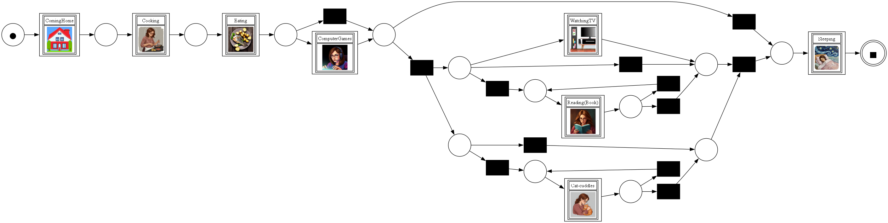

# Results: Activity Log Generation and Process Mining

## Overview

As part of the *CatNestIdentification* project, this section focuses on generating and analyzing activity logs to explore after-work routines — especially those shared with a cat. 

First, I generated artificial activity logs from the three defined **evening activity settings**. The generation either uses **fixed probabilities** to decide on the scenario or the data from **weather logs**.  

In a second step, **process mining** is executed. The performance comparison of mining the **entire log** versus mining **partitions** is interesting. The log is split up according to the scenario per case, with each scenario resulting in one partition.

For me, a **simple-to-understand visualization** is important. So I updated the visualization code to include **icons** in the Petri nets. The clear, intuitive icons improve the readability of the abstract process and motivate engagement.

  
*Example Petri Net showing combined routine behavior with activity icons.*

## Key Activities of the Settings

- **TV + Cat**: Watching TV while cuddling with the cat  
- **Reading + Cat**: Trying to read a book — the cat regularly demands cuddles  
- **Computer Gaming**: Undisturbed gaming session – potential attention for the cat afterward  

## Weather Dependency of the Settings

- **Weather data** is collected via `meteostat` for each evening.
- Based on three discrete weather conditions, the system chooses a setting:

  - **Bad weather**: Cat is inside → choose **TV + Cat**
  - **Mixed weather**: Cat may come/go → choose **Reading + Cat**
  - **Good weather**: Cat is outside → choose **Computer Gaming**

## Petri Net from Mining the Entire Log

The **initial activity sequence** is fixed:
- `ComingHome` → `Cooking` → `Eating`

The **final activity** is always:
- `Sleeping`

The **evening activities** vary depending on the chosen setting:
- Visible activities: `WatchingTV`, `Cat-cuddles`, `ComputerGaming`, `Reading(Book)`
- Since the entire log is mined at once, the three settings **blend together**, and their structure isn't clearly distinguishable.

## Performance Comparison

The mining performance is evaluated across increasing numbers of cases. Two types of artificial logs are compared:

- **Standard**: Based on fixed setting probabilities  
- **Weather**: Based on actual weather-influenced setting decisions

### Performance Metrics

| Label             | GlobalTime (s) | ParallelTime (s) | Common Relations | Only In Global |
|------------------|----------------|------------------|------------------|----------------|
| Standard_5000    | 0.87           | 2.49             | 6                | 8              |
| Weather_5000     | 0.91           | 2.03             | 6                | 8              |
| Standard_10000   | 1.36           | 2.58             | 6                | 8              |
| Weather_10000    | 2.11           | 1.16             | 6                | 8              |
| Standard_20000   | 2.96           | 2.41             | 6                | 8              |
| Weather_20000    | 3.25           | 2.51             | 6                | 8              |
| Standard_50000   | 7.99           | 6.23             | 6                | 8              |
| Standard_100000  | 14.22          | 12.46            | 6                | 8              |

### Interpretation

- The **GlobalTime** increases steadily with the number of cases.
- The **Weather-dependent model** generally has slightly higher total execution time.
- However, **ParallelTime** is often **shorter** for the weather model. Indicating that the benefits of partitioning the log depend on the distribution of the setting for the process.

## Conclusion

The log generation and process mining approach successfully simulates human-cat behavior under varying weather conditions. **Mining on partitions** based on scenario types (e.g., "TV + Cat") provides a clearer structure and **better insight into individual routines** compared to mining on a merged full log.  

From a performance perspective, mining the **weather-dependent** log results in a slightly **longer total execution time** but often benefits from **better parallelization**. The visualization improvements — especially activity-specific **icons** — provide a more inviting, readable experience and demonstrate that clarity and technical precision can go hand in hand.
